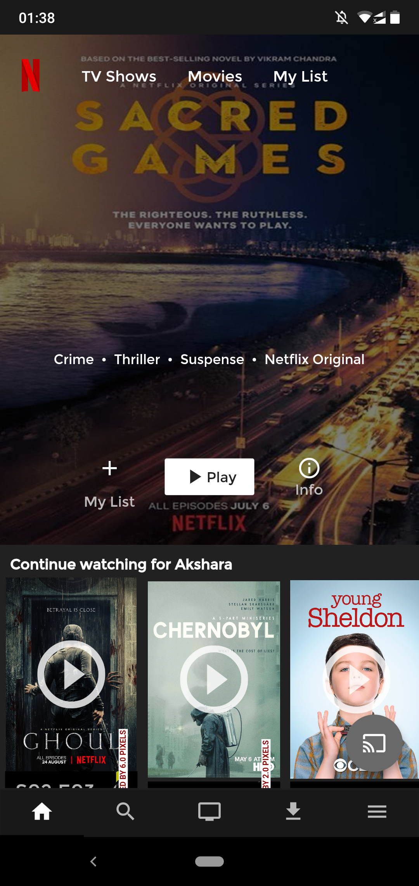
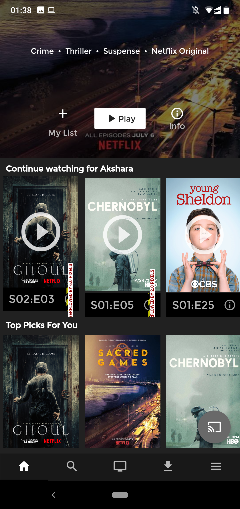
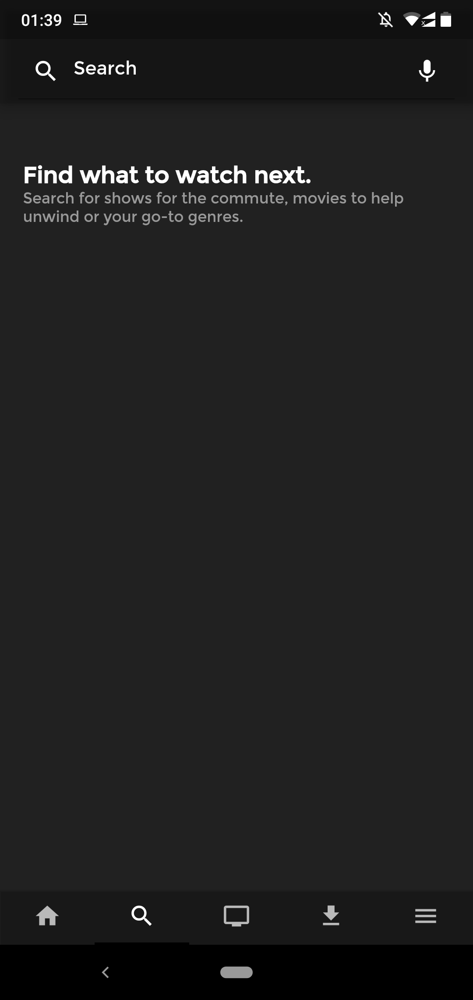
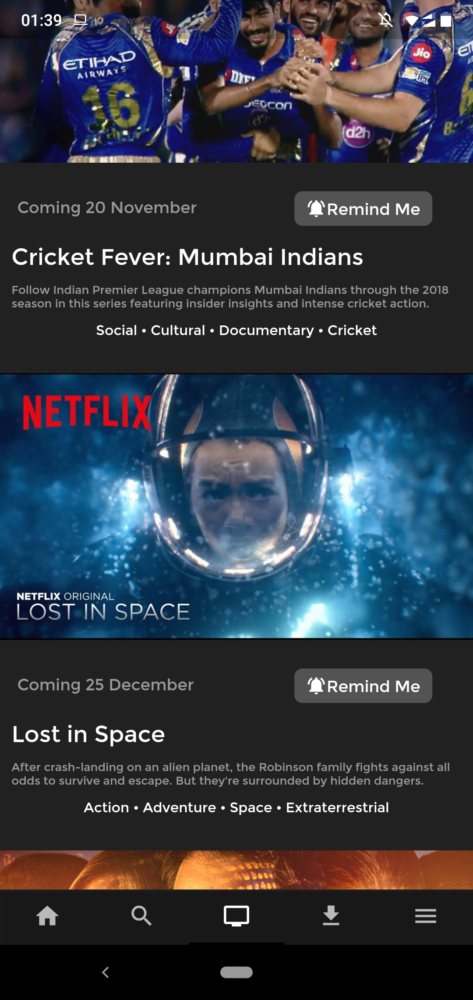
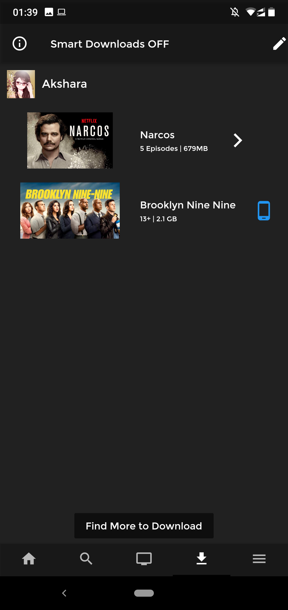
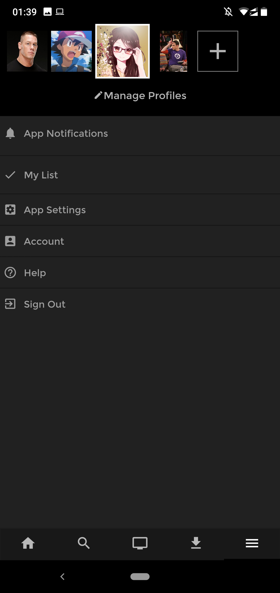

<h1 align="center">Sasta Netflix</h1>

 

 
<h3>A Sasta Netflix clone so good, ki tum bhul jaoge ki asli kaunsa hai and nakli kaunsa! :sunglasses:</h3>

---
# Screenshots

.
. 
.
.
.
.

 - Final APK is available in the [Screenshots Folder](Screenshots).
 
 #### This project still has scope of development, so you can also contribute to this Project as follows:
* [Fork](https://github.com/arghyadeep99/Sasta-Netflix) this Repository.
* Clone your Fork on a different branch:
	* `git clone -b <name-of-branch> https://github.com/arghyadeep99/Sasta-Netflix.git`
* After adding any feature:
	* Goto your fork and create a pull request.
	* We will test your modifications and merge changes.

This project was done `as a part of our Flutter audit course.`

---
<h3 align="center"><b>Developed with :heart: by <a href="https://github.com/arghyadeep99">Arghyadeep Das</a>, <a href="https://github.com/anittala">Akshara Nittala</a> and <a href="https://github.com/adityak14">Aditya Kaushik</a>.</b></h1>
